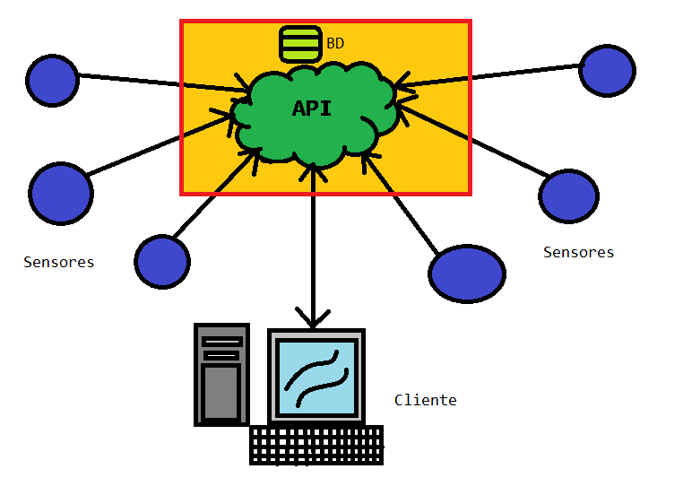

# Proyecto [TEL252] CRIPTOGRAFÍA Y SEGURIDAD EN LA INFORMACIÓN

Comunicación segura para sensores y redes IoT.

## Herramientas

- Node.js
- Express.js
- MySQL
- AES
- Cesar (Sustitución)
- Curvas elípticas
- Firebase

## Diagrama explicativo de la red

## Integrantes

| Nombre | Rol |
| ---- | ---- | 
| ... | ... |
| ... | ... |
| ... | ... |
| Mario Araya F | 201630003-1 |
